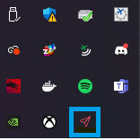
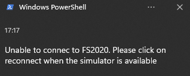

# VSI 🛬

<p align="center">
    
</p>

A small Windows Tray app which send a notification when your aircraft touchdown on the FS2020 simulator

## How to use

1. Download the latest release available [here](https://github.com/shigedangao/vsi/releases). The filename should be **vsi.zip**.
2. Once download, extract the **vsi.exe** from the zip file.
3. Launch the app. It should appear on the system tray like the image

### Red icon



If the icon appear in **red** like above. This mean that the simulator is not running. The app should have already notified that the simulator is not running like below.



In this case, when the sim is available. You may right click on the icon and click on the button `Re-connect to FS2020`. The icon should then turn blue

## Requirements

- Rust
- Windows
- FS2020
- FS2020 SDK
- FS2020 SDK sample
- Visual studio

## Local dev

1. Clone this repository
2. Comment the `main.rs` by commenting the line below

```diff
- #![windows_subsystem = "windows"]
+ // #![windows_subsystem = "windows"]
```

3. Run the project with the command

```shell
cargo run
```

## Issues

❌ Setting the *AppUserModelID* work with the window-rs crate. See the branch *try-notif*. However no notification appear for some reasons... It could be required that the app need to be installed with something ? maybe an exe in a specified path with registration key

## What is currently displayed during a touchdown ?

- G Force
- Touchdown velocity in fpm
- Touchdown pitch deg (so far it's negative might need to invert the value)
- Touchdown heading
- Touchdown bank deg
